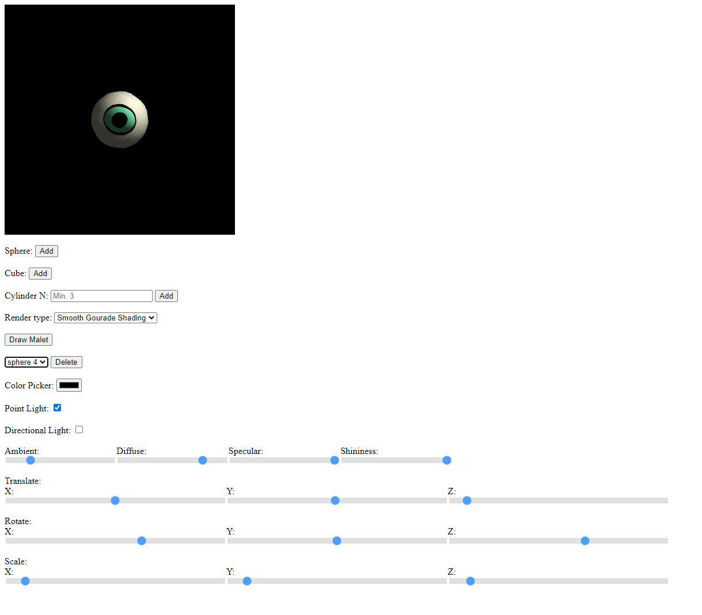

# viewport-webGL 

    <h1> WebGL Viewport 5/23/21 </h1>
    <h3>Description:</h3> 
This project can render customizable cylinders,
    cubes, and spheres in real time. The user's abilities range from assigning object's 
    RGB color, changing between rendering modes, toggling lights in the scene, being 
    able to manipulate the objects with translating, rotating, and scaling
    in the xyz axes, moving the camera, and choosing what kind of projection.

     
    
<b>How to run:</b>
     1.) Click on "Code" button on top right
     2.) Then "Download ZIP"
     3.) Extract the files
     4.) Open driver.html
     5.) Reference this page for help

    
<b>User Guide:</b>
    <li>Sphere Add button: puts a sphere into the Scene</li>
    <li>Cube Add button: puts a cube into the Scene</li>
    <li>N text box: to specify the amount of sides you want your cylinder to be</li>
    <li>Press the Add button to create a cylinder with N: #sides</li>
    <li>Render Type Selctor Box: choose between three commonly used rendering modes, Wireframe, Flat shading, and Smooth Gourade shading.</li>
    <li>Orthographic Checkbox- if checked the camera will be using orthographic projection if not checked it will be using perspective projection.</li>
    <li>Drop Down menu: Used to select which cylinder you want to customize</li>
    <li>Delete button: press to delete the object selected in the drop down menu</li>
    <li>Color Picker: can assign any color to the cylinder currently selected</li>
    <li>Point light Checkbox: One can toggle on and off a Point light at position (1.0, 1.0, -1.0)</li>
    <li>Directional Light checkbox: One can toggle on and off a Directional light with Vector [1.0, 3.0, -3.0]</li>
    <li>Ambient Slider: general lighting</li>
    <li>Diffuse Slider: scattered lighting</li>
    <li>Specular Slider: surface reflectance</li>
    <li>Shininess Slider: affects the shininess of surface</li>
    <li>Translate, Rotate, Scale sliders: can T.R.S the selected cylinder on any axis</li>
    <li>Zoom Out slider: One can zoom out of the scene 

    
<b>Keys:</b>
     W/S- Move camera forwards/backwards
     A/D- Move camera left/right
     Q/E- Pan camera left/right
     Z/X- tilt Camera up/down
     T- Camera spiraling Animation around thbe origin

    
<b>Note: </b>X axis is horizontal, Y axis is vertical, Z axis is forwards/away

